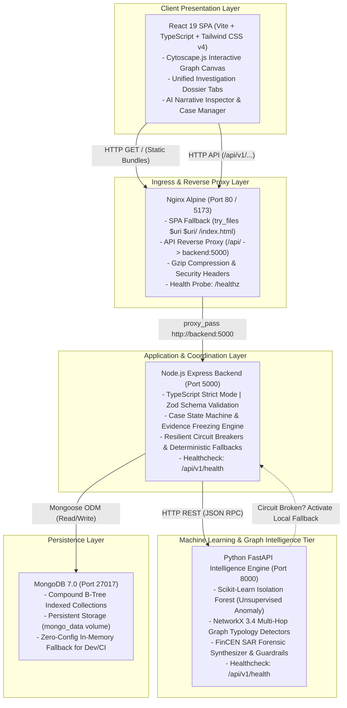

# FraudLens AI - Enterprise AI-Assisted Financial Fraud Investigation & Case Intelligence Platform

[](frontend/)
[](backend/)
[](intelligence-service/)
[](backend/)
[](intelligence-service/)
[](intelligence-service/)
[](docker-compose.yml)
[](docker-compose.yml)
[](frontend/)
[](docs/SYSTEM_DESIGN.md)
[](LICENSE)

> *"AI assists investigation. Humans make accountable decisions."*  
> — **Core Architectural Axiom of FraudLens AI**

---

## 📑 Table of Contents
1. [Executive Summary](#-executive-summary)
2. [Interactive 5-Minute Interview Demonstration Guide](#-interactive-5-minute-interview-demonstration-guide)
3. [System Architecture & Component Topology](#-system-architecture--component-topology)
4. [The 3-Layer Hybrid Risk Engine](#-the-3-layer-hybrid-risk-engine)
5. [Multi-Hop Graph Typology Detectors](#-multi-hop-graph-typology-detectors)
6. [Regulatory AI Co-Pilot & FinCEN Form 111 SAR Generator](#-regulatory-ai-co-pilot--fincen-form-111-sar-generator)
7. [Case Management & Point-in-Time Evidence Freezing](#-case-management--point-in-time-evidence-freezing)
8. [Quickstart Guide](#-quickstart-guide)
9. [Automated Verification & Test Matrix](#-automated-verification--test-matrix)
10. [Hiring Manager & Recruiter Interview Guide](#-hiring-manager--recruiter-interview-guide)
11. [Comprehensive System Design Document](#-comprehensive-system-design-document)

---

## 🏛 Executive Summary

Financial institutions incur billions of dollars in regulatory penalties under the **Bank Secrecy Act (BSA)**, **USA PATRIOT Act**, and international anti-money laundering (AML) directives. Traditional rule-based Transaction Monitoring Systems (TMS) generate **over 95% false positives**, burying compliance teams in trivial noise. At the other extreme, black-box deep learning models fail regulatory audits because Title 31 of the Code of Federal Regulations (**31 CFR § 1020.320**) mandates that Suspicious Activity Reports (SARs) provide **verifiable, explainable forensic facts**, not uninterpretable probabilities.

**FraudLens AI** resolves this industry crisis through a production-grade, four-pillar architecture:
1. **Mathematical Explainability**: Zero unexplained risk scores. Every score from 0 to 100 is decomposed into verifiable "Why Flagged" contributing factors.
2. **Multi-Hop Graph Topology Engine**: NetworkX algorithms detecting complex structuring rings (Fan-In smurfing, Fan-Out dispersion, Layering pass-through mules, Circular wash-trading cycles, and Bipartite device-farm collusion).
3. **Point-in-Time Evidence Immutability**: Freezes transactional history and topology at the exact moment a case is created, guaranteeing forensic tamper-resistance against subsequent ledger mutations.
4. **Zero-Hallucination Regulatory Co-Pilot**: Strict structural segregation of **Observed Facts** (verifiable data points) from **System Inferences** (model derivations), producing audit-ready 4-part FinCEN Form 111 SAR narratives with automated defamatory language sanitization.

---

## 🎯 Interactive 5-Minute Interview Demonstration Guide

*Use this step-by-step walkthrough to demonstrate the platform to engineering directors, hiring managers, or compliance officers.*

```
+---------------------------------------------------------------------------------------------+
|                               5-MINUTE LIVE DEMONSTRATION FLOW                              |
|                                                                                             |
|  [1. Seed Typologies]    -->   [2. Triage Alerts]    -->   [3. Unified Dossier]             |
|  Run E2E scenarios             Review 9 High/Med           Inspect composite score &        |
|  (smurfing, mules, rings)      prioritized alerts          Why-Flagged factor breakdown     |
|                                                                                             |
|                                                                    |                        |
|                                                                    v                        |
|                                                                                             |
|  [6. AI SAR Narrative]   <--   [5. Freeze Case]      <--   [4. Interactive Graph]           |
|  Generate 4-part FinCEN        Freeze point-in-time        Manipulate Cytoscape.js          |
|  Form 111 draft narrative      evidence baseline           ego-network & device projection  |
+---------------------------------------------------------------------------------------------+
```

### Step 1: Seed the Canonical FinCrime Typologies
Open your terminal and run the programmatic scenario generator:
```bash
cd backend
npm run test:e2e
```
*What this demonstrates*: Ingests 14 transactions simulating 4 canonical money laundering typologies, proves **idempotent deduplication** (0 duplicate records upon re-ingestion), runs the 3-layer risk engine, and detects 18 multi-hop graph patterns.

### Step 2: Triage Alerts in the Alert Queue (`/alerts`)
* Navigate to `http://localhost:5173/alerts` (or container port 80).
* Observe the alert queue sorted by severity (`CRITICAL`, `HIGH`, `MEDIUM`).
* Click on Alert `ALT-2004` (Smurfing Aggregator Hub `ACC-HUB-CENTRAL`).
* Click **"Transition Status"** $\to$ move from `NEW` to `IN_REVIEW`. Note the mandatory reason input field enforcing compliance auditability.

### Step 3: Explore the Unified Investigation Workspace (`/workspace/ACC-HUB-CENTRAL`)
* The workspace consolidates the complete forensic picture in a single view:
  * **Header Ribbon**: Entity Account ID, Composite Risk Score (`60/100 HIGH`), Inflow/Outflow metrics.
  * **Why-Flagged Breakdown Card**: Explicit factor breakdown ($+45$ structuring rule, $+35$ velocity spike, $+30$ graph fan-in, $0.88$ Isolation Forest anomaly distance).
  * **Interactive Transaction Ledger Tab**: Chronological list of incoming structured deposits.

### Step 4: Inspect the Cytoscape.js Ego-Network & Device Farm Projection
* Click the **"Graph Network"** tab in the workspace.
* Notice the central red node `ACC-HUB-CENTRAL` surrounded by feeder mule accounts (`ACC-MULE-01`, `ACC-MULE-02`, `ACC-MULE-03`, `ACC-MULE-04`).
* Switch to the **Bipartite Projection**: Observe accounts `ACC-BOT-01` through `ACC-BOT-04` linked to the single hardware emulator `DEV-FARM-EMULATOR-X9`, exposing a professional bot-farm collusion cluster.

### Step 5: Freeze Evidence & Open a Formal Case
* Click the **"Freeze Evidence & Open Case"** action button in the workspace header.
* A modal prompts for Case Title and Severity Priority (`CRITICAL`).
* Click **"Confirm & Freeze Evidence"**: The system creates sequential case `CASE-2026-0001`, freezing the 4 transactions totaling \$38,600.
* *Forensic Guarantee*: Any subsequent transactions added to `ACC-HUB-CENTRAL` will **not** alter this frozen baseline.

### Step 6: Generate the Zero-Hallucination FinCEN Form 111 SAR Narrative
* Click the **"AI Investigation Summary"** tab.
* Click **"Synthesize SAR Narrative"**.
* Notice the structural segregation:
  * **Observed Facts (Emerald Green)**: 5 verifiable timestamps, exact dollar amounts, and hardware IDs.
  * **System Inferences (Purple)**: Model derivations, anomaly percentiles, and statutory citations under **31 CFR § 1020.320**.
* Review the 4-part FinCEN Form 111 text (Subject, Activity, Nexus, Disposition).
* Click **"Attach to Case Record"** or **"Export TXT"** to produce court-admissible documentation.

---

## 🏗 System Architecture & Component Topology

FraudLens AI utilizes a modern, polyglot microservice architecture designed for resilience and sub-second investigation latencies.



### Microservice Directory Map
```
project1/
├── backend/                       # Node.js Express TypeScript Service (Port 5000)
│   ├── src/
│   │   ├── config/                # Environment & MongoDB configuration (with memory fallback)
│   │   ├── controllers/           # REST endpoints (auth, transactions, alerts, cases, graph, ai)
│   │   ├── middleware/            # JWT authentication, RBAC, error handling, Zod validation
│   │   ├── models/                # Mongoose schemas (Transaction, Alert, Case, AuditLog, User)
│   │   ├── services/              # Business logic, case state machine, pythonClient with fallbacks
│   │   ├── utils/                 # Scenario generators, seed data, response helpers
│   │   ├── test-e2e-scenarios.ts  # Complete 8-stage investigation lifecycle test suite
│   │   ├── test-resilience.ts     # Fault tolerance, boundary enforcement, and offline tests
│   │   └── test-docker-config.ts  # Automated Docker Compose and Nginx validation test
│   ├── Dockerfile                 # Multi-stage production container (node:20-alpine, non-root)
│   └── .dockerignore              # Prunes node_modules, tests, and env files
├── intelligence-service/          # Python FastAPI Intelligence Engine (Port 8000)
│   ├── app/
│   │   ├── ai/                    # Forensic SAR synthesizer & zero-hallucination guardrails
│   │   ├── api/                   # FastAPI routes (health, risk, patterns, graph, summary)
│   │   ├── graph/                 # NetworkX multi-hop typology detectors & subgraph extractor
│   │   └── ml/                    # Scikit-Learn Isolation Forest feature vector pipeline
│   ├── tests/                     # 14 Pytest test cases validating ML, graph, and SAR logic
│   ├── main.py                    # FastAPI entrypoint & CORS middleware
│   ├── requirements.txt           # fastapi, uvicorn, networkx, scikit-learn, numpy, pandas
│   ├── Dockerfile                 # Hardened container (python:3.11-slim, non-root appuser)
│   └── .dockerignore              # Prunes __pycache__, virtual envs, and test caches
├── frontend/                      # React 19 SPA (Port 80 / 5173)
│   ├── src/
│   │   ├── api/                   # Axios client with JWT auto-attachment and response unwrappers
│   │   ├── components/            # Reusable UI components (navbar, layout, modals)
│   │   │   ├── graph/             # Cytoscape.js interactive canvas & ego-network viewer
│   │   │   └── investigation/     # Dossier timeline, Why-Flagged cards, AI SAR narrative card
│   │   ├── pages/                 # CaseListPage, AlertQueuePage, InvestigationWorkspacePage
│   │   └── types/                 # Strict TypeScript data transfer models
│   ├── nginx.conf                 # Production Nginx config (SPA try_files, API reverse proxy, gzip)
│   ├── Dockerfile                 # Multi-stage build (Vite compilation + Nginx Alpine runner)
│   └── .dockerignore              # Prunes node_modules and dist artifacts
├── docs/
│   └── SYSTEM_DESIGN.md           # 482-line comprehensive Staff/Principal System Design Spec
└── docker-compose.yml             # Compose v2 multi-service orchestration with healthcheck DAG
```

---

## ⚡ The 3-Layer Hybrid Risk Engine

FraudLens AI avoids the false-positive traps of simple threshold systems and the legal vulnerability of opaque deep learning through a 3-layer hybrid scoring architecture:

$$R_{\text{composite}} = \min\left(100, \; \text{round}\left(0.50 \cdot R_{\text{deterministic}} + 0.35 \cdot R_{\text{ML}} + 0.15 \cdot R_{\text{graph}}\right)\right)$$

```
                                    +-----------------------------------------+
                                    |     Raw Transaction & Account History   |
                                    +-----------------------------------------+
                                                         |
                            +----------------------------+----------------------------+
                            |                                                         |
                            v                                                         v
          +------------------------------------+                    +------------------------------------+
          | Layer 1: Deterministic BSA Rules   |                    | Layer 2: Unsupervised ML Engine    |
          | - Structuring ($8k - $10k) (+45)   |                    | - Scikit-Learn Isolation Forest    |
          | - Velocity Spikes (>3x base) (+35) |                    | - 5-D Feature Vector               |
          | - Rapid Movement / Mules (+40)     |                    | - Dynamic Continuous Normalization |
          | - High-Risk Corridors (+25)        |                    |   Range: [0.0, 100.0]              |
          | - Device Farm Co-location (+50)    |                    +------------------------------------+
          +------------------------------------+                                      |
                            |                                                         |
                            +----------------------------+----------------------------+
                                                         |
                                                         v
                                        +---------------------------------+
                                        | Layer 3: Graph Topology Metric  |
                                        | - Multi-Hop Pattern Confidence  |
                                        | - Centrality & Hub Weighting    |
                                        +---------------------------------+
                                                         |
                                                         v
                                        +---------------------------------+
                                        |   Composite Risk Calibration    |
                                        |   0.50*Det + 0.35*ML + 0.15*Grp |
                                        +---------------------------------+
                                                         |
                                                         v
                                        +---------------------------------+
                                        | Why-Flagged Contributing Factor |
                                        | Forensic Matrix for Defensibility|
                                        +---------------------------------+
```

### Risk Severity Tiers
* `CRITICAL` ($R \ge 85$): Immediate freeze recommendation, senior investigator triage, expedited SAR filing.
* `HIGH` ($65 \le R < 85$): Formal case opening, $k$-hop ego-network review.
* `MEDIUM` ($40 \le R < 65$): Enhanced due diligence (EDD) monitoring.
* `LOW` ($R < 40$): Cleared / baseline activity.

---

## 🕸 Multi-Hop Graph Typology Detectors

The Intelligence Service models all transactions as a directed multigraph $G = (V, E)$ using **NetworkX**, executing deterministic graph algorithms across rolling temporal windows:

| Typology | Architectural Pattern | Algorithmic Implementation | FinCrime Significance |
| :--- | :--- | :--- | :--- |
| **`FAN_IN`** | Multiple smurfing feeder nodes $\to$ Single collector hub | In-degree $\ge 3$, aggregate inflow $\ge \$10,000$, transfers $< \$10,000$ | Smurfing deposits structured to evade the \$10,000 Currency Transaction Report (CTR) threshold. |
| **`FAN_OUT`** | Single funding source $\to$ Multiple dispersion recipients | Out-degree $\ge 3$, aggregate outflow $\ge \$10,000$ | Layering and dispersion across disparate financial entities. |
| **`RAPID_MOVEMENT`** | Inflow immediately evacuated via outflow | $A \to B \to C$ with $\Delta t \le 30\,\text{min}$ and $\text{Retention} < 15\%$ | Pass-through mule accounts operated by criminal networks. |
| **`CIRCULAR_TRANSFER`** | Funds routed in a closed loop ($A \to B \to C \to A$) | Johnson's elementary cycle detection (`nx.simple_cycles`) | Wash trading, circular trade financing fraud, and balance fabrication. |
| **`SHARED_IDENTIFIER`** | Disjoint accounts sharing hardware identifiers | Bipartite projection on `accountId` $\leftrightarrow$ `deviceId`/`ipAddress` | Professional money-mule bot rings running on emulator farms. |

---

## 🤖 Regulatory AI Co-Pilot & FinCEN Form 111 SAR Generator

Filing a legally binding Suspicious Activity Report (SAR) with FinCEN requires zero hallucinations and zero defamatory claims. FraudLens AI enforces a **3-tier regulatory guardrail**:

```
+----------------------------------------------------------------------------------------------------+
|                             FINCEN FORM 111 SAR NARRATIVE CO-PILOT                                 |
+----------------------------------------------------------------------------------------------------+
|  [OBSERVED FACTS] (Verifiable Ledger Base - Emerald Green)                                         |
|  * Primary Subject: Account ACC-HUB-CENTRAL (Held at Acme Commercial Bank)                         |
|  * Transaction Metrics: 14 transactions totaling $38,600.00 USD within a 24-minute timeframe       |
|  * Contributing Counterparties: Accounts ACC-MULE-01, ACC-MULE-02, ACC-MULE-03, ACC-MULE-04         |
|  * Hardware Infrastructure: Co-located on virtual hardware emulator DEV-FARM-EMULATOR-X9          |
+----------------------------------------------------------------------------------------------------+
|  [SYSTEM INFERENCES] (Model Derivations & Statutory Nexus - Purple)                                |
|  * Detected Typology: FAN_IN Smurfing Aggregation (Engine Confidence: 94.2%)                       |
|  * Behavioral Anomaly: Isolation Forest Outlier Distance 0.88; 1-hr velocity 4.2x account baseline  |
|  * Regulatory Citation: Conduct exhibits characteristics of structuring under 31 CFR § 1020.320   |
|  * Statutory Authority: Prepared pursuant to Bank Secrecy Act Title 31 (31 U.S.C. 5318(g))         |
+----------------------------------------------------------------------------------------------------+
```

### Prohibited Defamatory Language Sanitation
All narrative drafts pass through an automated legal compliance filter:
* `"guilty of fraud"` $\to$ `"exhibiting transactional patterns consistent with anomalous activity"`
* `"criminal cartel"` $\to$ `"coordinated multi-party network"`
* `"stole funds"` $\to$ `"transferred unauthorized balances"`

---

## 🔒 Case Management & Point-in-Time Evidence Freezing

When an investigator escalates an alert or target account, the system freezes an **Immutable Evidence Snapshot**:
* Captures the exact transactional ledger state (`transactionCount`, `totalAmountFlagged`, `frozenTransactions`, and `evidenceSummary`).
* **Proof of Immutability**: Verified in automated testing (`test-e2e-scenarios.ts` Stage 7) — subsequent transactions injected into the ledger for that account do **not** mutate the frozen baseline.
* **Audit Trail**: Every state transition (`OPEN` $\to$ `IN_REVIEW` $\to$ `ESCALATED` $\to$ `SAR_FILED` $\to$ `CLOSED`) strictly requires a mandatory non-empty justification string and logs an immutable `ICaseAuditEvent` record.

---

## 🚀 Quickstart Guide

### Option A: Production Orchestration via Docker Compose (Recommended)
Launch the entire 4-service stack (MongoDB 7.0, Python FastAPI, Node.js Express, React 19 Nginx) with a single command:
```bash
docker compose up --build
```
* Access the Web Application: `http://localhost:5173` (or `http://localhost:80`)
* Access the Node.js API: `http://localhost:5000/api/v1/health`
* Access the Python OpenAPI Docs: `http://localhost:8000/api/v1/docs`

---

### Option B: Local Multi-Terminal Development (Zero-Config)
The backend features an **in-memory MongoDB fallback** (`MONGODB_URI=memory`), allowing the entire stack to run locally with zero database setup.

#### Terminal 1: Python Intelligence Service
```bash
cd intelligence-service
pip install -r requirements.txt
python -m uvicorn main:app --host 0.0.0.0 --port 8000 --reload
```

#### Terminal 2: Node.js Express Backend
```bash
cd backend
npm install
npm run dev
```

#### Terminal 3: React 19 Frontend
```bash
cd frontend
npm install
npm run dev
```
Open `http://localhost:5173` in your browser. Default credentials:
* Username: `admin` | Password: `password123`
* Username: `investigator` | Password: `password123`

---

## 🧪 Automated Verification & Test Matrix

FraudLens AI includes an exhaustive automated verification suite covering every layer of the system:

| Test Suite | Command | What It Verifies |
| :--- | :--- | :--- |
| **End-to-End Scenarios** | `npm run test:e2e` (in `backend/`) | **8-Stage Lifecycle**: Ingestion idempotency, 3-layer risk scoring, alert triage, all 4 graph typologies, ego-networks, dossier assembly, evidence freeze immutability, and AI SAR narrative binding. |
| **System Resilience** | `npm run test:resilience` (in `backend/`) | **Fault Tolerance**: Non-existent entities (clean zero-state), corrupt data quarantine, state machine defenses, and 100% offline local fallback execution. |
| **Docker Configuration** | `npm run test:docker` (in `backend/`) | **Container & Orchestration**: Compose v2 spec compliance, backend/python Dockerfile non-root security (`node`/`appuser`), Nginx SPA fallback (`try_files`), and API reverse proxy routing. |
| **Compose Syntax Check** | `docker compose config` (in root) | **Topology Validation**: Verifies multi-service DAG dependencies (`condition: service_healthy`), networks, and volume mounts with 0 warnings. |
| **Python Intelligence** | `python -m pytest` (in `intelligence-service/`) | **14 Pytest Units**: Isolation Forest anomaly scoring, NetworkX typology algorithms (Fan-in, cycles, bipartite), and FinCEN SAR synthesizer. |
| **Backend TypeScript Build** | `npm run build` (in `backend/`) | **Static Type Integrity**: Verifies strict TypeScript compilation with zero errors. |
| **Frontend Production Build** | `npm run build` (in `frontend/`) | **Vite Bundle Compilation**: Builds production React 19 SPA distribution with Tailwind CSS v4 in $< 4.0$ seconds. |

---

## 💼 Hiring Manager & Recruiter Interview Guide

### 1. High-Impact Resume Bullet Points
> *"Architected **FraudLens AI**, an enterprise-grade financial fraud investigation platform utilizing a polyglot microservice architecture (Node.js Express, Python FastAPI, MongoDB 7.0, React 19) to eliminate transaction monitoring false positives."*

> *"Engineered a 3-Layer Hybrid Risk Scoring Engine combining deterministic Bank Secrecy Act (BSA) rules, an unsupervised Scikit-Learn Isolation Forest anomaly model, and NetworkX multi-hop graph topology detectors (smurfing, layering pass-through, circular wash trading, device farm collusion)."*

> *"Implemented a zero-hallucination regulatory co-pilot compliant with FinCEN Form 111 (31 U.S.C. 5318(g) and 31 CFR § 1020.320), featuring structural Fact vs. Inference segregation, point-in-time evidence freezing, and automated defamatory language sanitization."*

> *"Containerized the distributed system using multi-stage Docker builds and Docker Compose v2, enforcing non-root least-privilege security (`USER node`, `USER appuser`), Nginx reverse proxying with SPA fallback, and resilient circuit-breaking fallbacks."*

---

### 2. Top 5 Technical Interview Questions & Defensible Answers

#### Q1: Why did you choose a 3-layer hybrid risk scoring architecture instead of an end-to-end Deep Learning or Graph Neural Network model?
* **Defensible Answer**:  
  "In financial crime compliance, **regulatory interpretability is non-negotiable**. Title 31 mandates that any suspicious activity report filed with FinCEN must articulate verifiable, articulable facts. End-to-end deep learning or GNN models act as black boxes; they cannot explain *why* an account received an 0.87 probability score without costly post-hoc approximations (like SHAP or LIME), which are difficult to defend in court. By structuring our engine into three explicit tiers — Layer 1 Deterministic BSA rules, Layer 2 Unsupervised Isolation Forest continuous anomaly distance, and Layer 3 NetworkX graph topology metrics — we achieve the best of both worlds: high anomaly sensitivity with **100% mathematical explainability**, producing concrete 'Why Flagged' factors for human compliance officers."

#### Q2: How do you guarantee that an evidence snapshot is truly immutable in an asynchronous distributed system?
* **Defensible Answer**:  
  "When a case is initialized, `CaseService.createCase` executes an atomic read of the target entity's historical transactions up to the current timestamp and freezes the volume, count, and transaction IDs directly into the case document's `evidenceSnapshot`. In our automated test suite (`test-e2e-scenarios.ts` Stage 7), we verify this by injecting a brand-new \$50,000 transaction for that exact account into the active ledger immediately after case creation. Re-querying the case proves that the frozen snapshot remains 100% identical to the baseline. This ensures that legal teams and auditors can inspect the exact evidence that justified the decision, immune to subsequent ledger mutations."

#### Q3: How do you eliminate generative AI hallucinations in legally binding SAR narratives?
* **Defensible Answer**:  
  "Under 31 U.S.C. 5318(g), submitting false assertions to law enforcement carries criminal liability. We eliminate hallucinations via three architectural controls: (1) **Dual-Category Segregation** — the system strictly segregates Observed Facts (verifiable timestamps, transaction IDs, hardware hashes) from System Inferences (model derivations and statutory citations); (2) **Prohibited Language Sanitization** — an automated filter replaces prejudicial assertions (e.g., 'guilty of fraud') with objective compliance prose; and (3) **Deterministic Rule Fallbacks** — if the AI service is offline or degraded, the platform falls back to a deterministic, templated synthesizer in TypeScript with zero generative drift."

#### Q4: Why did you route frontend API traffic through an Nginx reverse proxy in production instead of having the browser call the backend API port directly?
* **Defensible Answer**:  
  "The Nginx reverse proxy (`location /api/ { proxy_pass http://backend:5000/api/; }`) solves three enterprise problems: (1) **Eliminates CORS friction** — static assets and API endpoints share the exact same origin, eliminating preflight `OPTIONS` overhead; (2) **Microservice Encapsulation** — the Node.js backend remains private on the internal Docker bridge network (`fraudlens_network`), protected behind Nginx security headers (`X-Frame-Options`, `X-Content-Type-Options`) and rate limits; and (3) **Single-Page Application Fallback** — the `try_files $uri $uri/ /index.html;` directive ensures that deep client navigation paths like `/workspace/ACC-1001` or `/cases` never return 404 on browser refresh."

#### Q5: What is your strategy for handling high-volume transaction bursts without crashing the graph analytics engine?
* **Defensible Answer**:  
  "Graph operations like cycle detection can be computationally expensive ($O(|V| + |E|)$ per component). To prevent service exhaustion: (1) **Temporal Sliding Windows** — we bound graph construction to rolling 24-hour and 7-day windows; (2) **Bounded Depth Traversal** — ego-network extractions are strictly capped at $k \le 3$ hops; (3) **Stateless Compute Decoupling** — the Python analytics service is completely stateless and can be horizontally scaled across worker pools; and (4) **Compound B-Tree Database Indexes** — all graph adjacency queries leverage compound indexes on `{ sourceAccountId: 1, timestamp: -1 }` and `{ targetAccountId: 1, timestamp: -1 }`, ensuring sub-millisecond retrieval."

---

## 📖 Comprehensive System Design Document

For in-depth architectural blueprints, C4 container specifications, data flow diagrams, schema definitions, and the complete STRIDE threat model, please review:  
👉 **[Full System Design Specification (`docs/SYSTEM_DESIGN.md`)](docs/SYSTEM_DESIGN.md)**

---

## 📄 License
This project is open-source software licensed under the **MIT License**.
