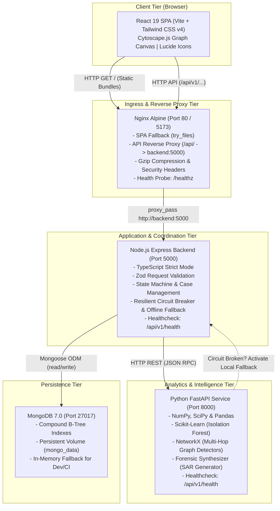
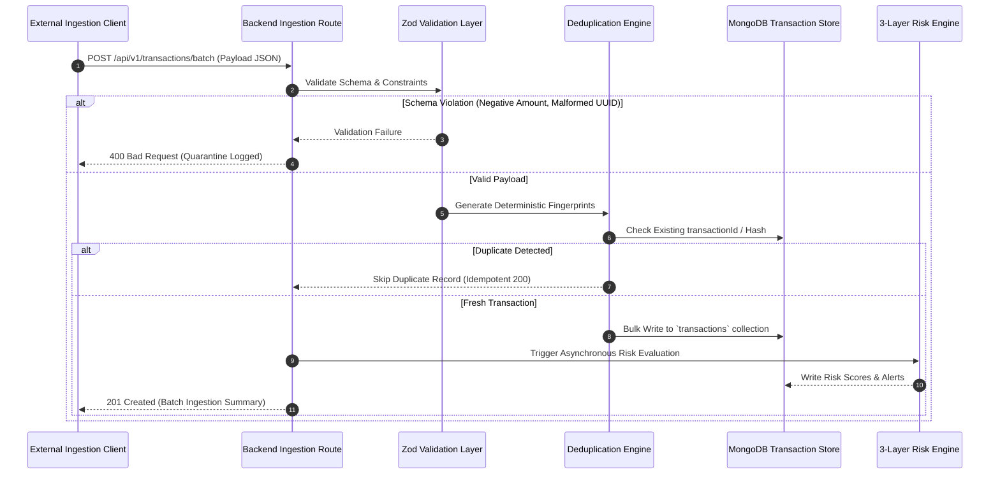
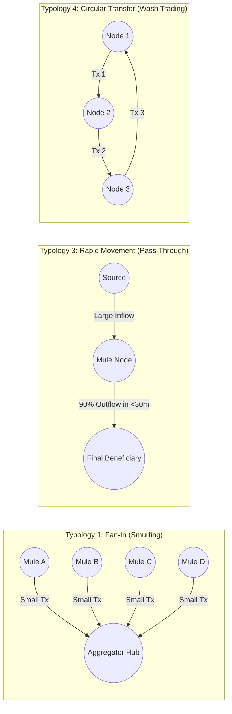
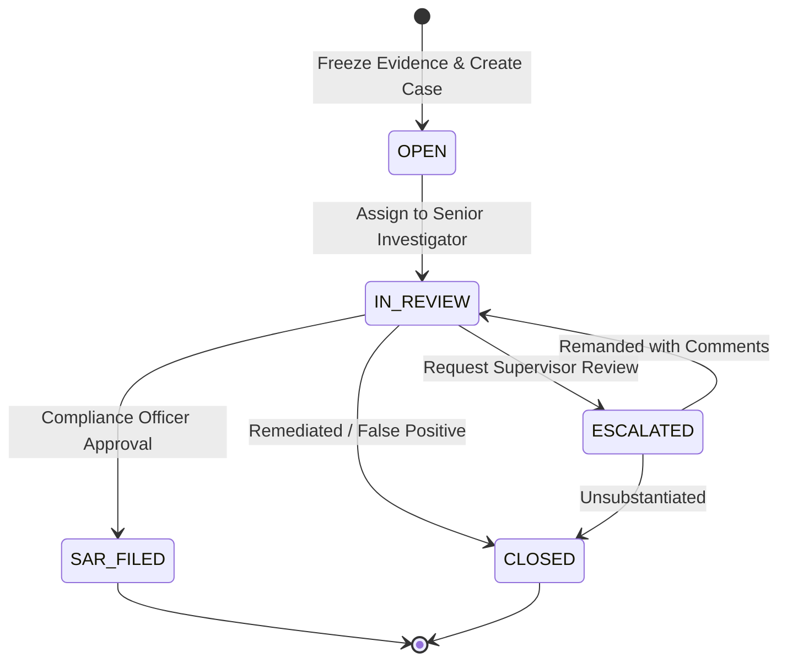
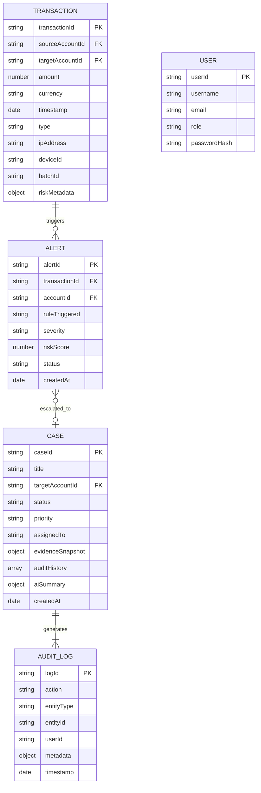

# FraudLens AI - Enterprise System Design & Architectural Specification

**Document Version**: 1.0.0  
**Author**: FinCrime Platform Architecture Team  
**Target Audience**: Staff/Principal Engineers, Engineering Leadership, Compliance Auditors, FinTech Technical Interviewers  
**Status**: Approved & Implemented  

---

## Table of Contents
1. [Executive Summary & Core Architectural Principles](#1-executive-summary--core-architectural-principles)
2. [High-Level Architecture & Component Topology](#2-high-level-architecture--component-topology)
3. [Data Ingestion & Normalization Pipeline](#3-data-ingestion--normalization-pipeline)
4. [3-Layer Hybrid Risk Scoring Engine](#4-3-layer-hybrid-risk-scoring-engine)
5. [Multi-Hop Graph Typology Detection Engine](#5-multi-hop-graph-typology-detection-engine)
6. [Case Management & Immutable Evidence Snapshots](#6-case-management--immutable-evidence-snapshots)
7. [Regulatory AI Co-Pilot & FinCEN Form 111 SAR Generator](#7-regulatory-ai-co-pilot--fincen-form-111-sar-generator)
8. [Data Models & Schema Specifications](#8-data-models--schema-specifications)
9. [REST API Contract Specifications](#9-rest-api-contract-specifications)
10. [Threat Model & Security Posture (STRIDE)](#10-threat-model--security-posture-stride)
11. [Production Operations, Scalability & Performance Benchmarks](#11-production-operations-scalability--performance-benchmarks)

---

## 1. Executive Summary & Core Architectural Principles

### 1.1 The Problem
Financial institutions face severe regulatory penalties (e.g., under the Bank Secrecy Act and USA PATRIOT Act) for failing to detect money laundering, terrorist financing, and structured smurfing operations. Traditional rule-based Transaction Monitoring Systems (TMS) suffer from **false positive rates exceeding 95%**, overwhelming compliance teams with trivial alerts. Conversely, "black box" deep learning approaches fail regulatory scrutiny because Title 31 of the Code of Federal Regulations (31 CFR § 1020.320) mandates that suspicious activity reports (SARs) provide **verifiable, explainable forensic evidence**, not uninterpretable probabilities.

### 1.2 Core Architectural Principles
FraudLens AI is engineered under four non-negotiable architectural axioms:

1. **"AI Assists Investigation. Humans Make Accountable Decisions."**  
   The platform never autonomously blocks accounts or files SARs without human compliance review. AI acts exclusively as an accelerated forensic co-pilot.
2. **Zero Unexplained Risk Scores (Mathematical Explainability)**  
   Every risk score between 0 and 100 is decomposed into verifiable contributing factors ("Why Flagged"), detailing the exact deterministic rule violations, machine learning anomaly distances, and multi-hop graph patterns responsible for the score.
3. **Fact vs. Inference Segregation**  
   Strict segregation is enforced between **Observed Facts** (verifiable transaction timestamps, amounts, hardware fingerprints) and **System Inferences** (model derivations, centrality percentiles, behavioral likelihoods) to prevent hallucinations from contaminating legal filings.
4. **Point-in-Time Forensic Immutability**  
   When an investigation case is initiated, evidence snapshots are frozen. Subsequent transactions or ledger adjustments can never overwrite or tamper with the historical evidence baseline presented in court or to regulatory auditors.

### 1.3 Scope Boundaries
To maintain absolute production discipline, architectural boundaries are strictly enforced:
* **Explicitly In Scope**: High-throughput ingestion, 3-layer risk scoring, unsupervised anomaly detection (Isolation Forest), multi-hop graph typology detection (5 typologies), interactive Cytoscape.js ego-networks, unified investigation dossier assembly, case state machine with frozen evidence, zero-hallucination AI SAR narrative generation with FinCEN Form 111 compliance, and production Docker containerization.
* **Explicitly Out of Scope**: Apache Kafka (unnecessary overhead for mid-tier throughput; direct streaming HTTP endpoints provide superior determinism), Kubernetes (Docker Compose provides complete local/staging parity without distributed cluster orchestration complexity), Graph Neural Networks (black-box embeddings violate regulatory interpretability; NetworkX deterministic cycle/bipartite algorithms provide 100% explainability).

---

## 2. High-Level Architecture & Component Topology

FraudLens AI is structured as a decoupled, polyglot microservice architecture orchestrated over an internal Docker bridge network (`fraudlens_network`).

### 2.1 C4 Container Architecture Diagram



### 2.2 Microservice Responsibilities & Inter-Service Protocol

| Service | Primary Stack | Responsibilities | Inbound Ports | Outbound Calls |
| :--- | :--- | :--- | :--- | :--- |
| **`frontend`** | React 19, TypeScript, Vite, Tailwind CSS v4, Cytoscape.js | High-density visual workspace, interactive ego-network graph manipulation, timeline rendering, SAR narrative inspection, case triage workflows. | `80` (public), `5173` (mapped) | `Nginx /api/` |
| **`backend`** | Node.js 20, Express, TypeScript, Mongoose, Zod, Axios | Ingestion pipelines, idempotency checks, session & case management, dossier assembly, orchestration of ML and graph endpoints, deterministic local fallback engine. | `5000` (internal/host) | `MongoDB:27017`, `Intelligence:8000` |
| **`intelligence-service`** | Python 3.11, FastAPI, NetworkX, Scikit-Learn, Pydantic | Unsupervised ML anomaly scoring (Isolation Forest), multi-hop graph typology detection, sub-graph extraction, FinCEN SAR narrative synthesis. | `8000` (internal/host) | None (Pure Stateless Compute) |
| **`mongodb`** | MongoDB 7.0 Alpine / `mongodb-memory-server` | Transactional persistence, alert queue records, immutable case snapshots, full audit log trails. | `27017` (internal/host) | None |

### 2.3 Resilient Circuit Breaking & Graceful Degradation
To achieve 99.99% operational availability in air-gapped or degraded production environments, `backend/src/services/pythonClient.ts` implements an automated **Graceful Degradation Pattern**:
* When the Python FastAPI service is unreachable (network partition, container crash, OOM), the backend does **not** fail the analyst request.
* It automatically catches the `ECONNREFUSED` / timeout exception and falls back to **`PythonClient.localPatternFallback`**, **`PythonClient.localRiskFallback`**, and **`PythonClient.localSummaryFallback`**.
* These TypeScript deterministic fallbacks execute localized cycle detection, BSA rule evaluations, and structured narrative generation, ensuring uninterrupted investigative workflows.

---

## 3. Data Ingestion & Normalization Pipeline

The ingestion pipeline supports high-throughput JSON streaming (`/api/v1/transactions/stream`) and bulk batch uploads (`/api/v1/transactions/batch`).

### 3.1 Ingestion Flowchart



### 3.2 Idempotency & Deduplication Guarantees
* Each transaction payload is verified for an external `transactionId`. If omitted, a cryptographic SHA-256 fingerprint is derived from:
  $$\text{Hash} = \text{SHA256}(\text{sourceAccountId} \parallel \text{targetAccountId} \parallel \text{amount} \parallel \text{timestamp})$$
* A unique compound database index (`{ transactionId: 1 }`) ensures that retried network requests or replayed batch files insert **0 duplicate records**.

---

## 4. 3-Layer Hybrid Risk Scoring Engine

FraudLens AI abandons opaque single-score models in favor of a defensible, multi-tiered risk calibration pipeline.

```
       [Raw Transaction & Account History]
                       |
        +--------------+--------------+
        |                             |
        v                             v
[Layer 1: Deterministic BSA]   [Layer 2: Unsupervised ML]
- Velocity Spike Rules          - Isolation Forest Model
- Rapid Movement / Mules        - 5-D Feature Vector
- Structuring ($8k - $10k)      - Continuous Distance Score
- High-Risk Corridors           - Dynamic Normalization
        |                             |
        +--------------+--------------+
                       |
                       v
       [Layer 3: Graph Topology Metric]
       - Centrality & Multi-Hop Typologies
                       |
                       v
         [Composite Risk Calibration]
   R_composite = 0.50*R_det + 0.35*R_ml + 0.15*R_graph
                       |
                       v
      [Why-Flagged Forensic Factor Matrix]
```

### 4.1 Layer 1: Deterministic Compliance Rules ($R_{\text{deterministic}}$)
Evaluates statutory Bank Secrecy Act rules and established FinCEN red flags:
1. **Structuring / Smurfing**: Amounts just below the CTR filing threshold (\$10,000 USD):
   $$8,000 \le \text{amount} < 10,000 \implies +45 \text{ points}$$
2. **Velocity Spike**: 1-hour transaction volume exceeding $3\times$ the account's 30-day baseline:
   $$\text{Velocity}_{1\text{h}} \ge 3 \times \overline{\text{Velocity}}_{30\text{d}} \implies +35 \text{ points}$$
3. **Rapid Movement (Mule Pass-Through)**: Inflow immediately followed by outflow within 30 minutes with $\ge 85\%$ volume depletion:
   $$\Delta t \le 1800\,\text{s} \quad \text{and} \quad \frac{\text{Outflow}}{\text{Inflow}} \ge 0.85 \implies +40 \text{ points}$$
4. **High-Risk Jurisdiction Corridors**: Cross-border corridors flagged by FATF non-cooperative jurisdictions:
   $$\text{isCrossBorder} = \text{true} \implies +25 \text{ points}$$
5. **Shared Device / Hardware Velocity**: Multiple accounts transacting from the exact same hardware fingerprint within a 10-minute window:
   $$\text{DistinctAccounts}(\text{deviceId}) \ge 3 \implies +50 \text{ points}$$

### 4.2 Layer 2: Unsupervised Machine Learning Anomaly Detection ($R_{\text{ML}}$)
* **Model**: Scikit-Learn `IsolationForest(n_estimators=100, contamination=0.05, random_state=42)`.
* **Feature Vector $\vec{x}$**:
  $$\vec{x} = \left[ \text{amount}, \; \ln(\text{amount} + 1), \; \text{hourOfDay}, \; \Delta_{\text{mean}}, \; z_{\text{velocity}} \right]$$
* **Normalization**: The raw decision function output $s \in [-1.0, 1.0]$ is inverted and scaled to $[0.0, 100.0]$:
  $$R_{\text{ML}} = \min\left(100.0, \; \max\left(0.0, \; \frac{0.5 - s}{0.8} \times 100\right)\right)$$

### 4.3 Layer 3: Graph Topology Score ($R_{\text{graph}}$)
Derived from the account's degree centrality, betweenness centrality, and participation in detected multi-hop typologies:
$$R_{\text{graph}} = \min\left(100, \; \sum_{t \in \text{Typologies}} w_t \cdot \text{confidence}_t\right)$$

### 4.4 Composite Calibration Formula
The final single score is calculated as a weighted convex combination bounded by 100:
$$R_{\text{composite}} = \min\left(100, \; \text{round}\left(0.50 \cdot R_{\text{deterministic}} + 0.35 \cdot R_{\text{ML}} + 0.15 \cdot R_{\text{graph}}\right)\right)$$

**Severity Tiers**:
* `CRITICAL`: $R_{\text{composite}} \ge 85$ (Immediate investigation required; priority SAR triage).
* `HIGH`: $65 \le R_{\text{composite}} < 85$.
* `MEDIUM`: $40 \le R_{\text{composite}} < 65$.
* `LOW`: $R_{\text{composite}} < 40$.

---

## 5. Multi-Hop Graph Typology Detection Engine

The Intelligence Service uses NetworkX to construct directed multigraphs $G = (V, E)$, where vertices $V$ represent financial accounts and external entities, and directed edges $E$ represent individual monetary transactions annotated with timestamps and amounts.



### 5.1 The 5 Canonical FinCrime Typology Detectors

1. **`FAN_IN` (Smurfing Aggregation)**:
   * *Pattern*: Many distinct accounts transmitting funds to a single collector hub within a rolling 24-hour window.
   * *Threshold*: $\text{In-Degree}(v) \ge 3$, aggregate inflow $\ge \$10,000$, and individual transfers $< \$10,000$.
2. **`FAN_OUT` (Dispersion Layering)**:
   * *Pattern*: A single primary account dispersing large balances across multiple recipient accounts within hours.
   * *Threshold*: $\text{Out-Degree}(v) \ge 3$, aggregate outflow $\ge \$10,000$.
3. **`RAPID_MOVEMENT` (Layering Mule Pass-Through)**:
   * *Pattern*: Account acts as a pure transit conduit. Inflow $A \to B$ is followed by outflow $B \to C$ within $\le 30$ minutes with retention $< 15\%$.
   * *Algorithmic Complexity*: $O(|E_{\text{in}}| \cdot |E_{\text{out}}|)$ evaluated over temporal sliding windows.
4. **`CIRCULAR_TRANSFER` (Wash-Trading Cycles)**:
   * *Pattern*: Directed cycles where money returns to the originator (e.g., $A \to B \to C \to A$) to fabricate legitimate trade volume or mask source-of-funds.
   * *Implementation*: Johnson's elementary cycle detection algorithm (`nx.simple_cycles`) restricted to cycle lengths $k \in [3, 6]$.
5. **`SHARED_IDENTIFIER` (Device Farm Collusion)**:
   * *Pattern*: Bipartite graph projection where multiple distinct accounts share the exact same hardware `deviceId` or `ipAddress`.
   * *Significance*: Detects automated bot farms and professional money-mule rings operating from emulator clusters.

### 5.2 Ego-Network Subgraph Extraction ($k$-Hop BFS)
To render responsive graph views in the browser, the backend requests localized subgraphs:
$$G_{\text{ego}}(v, k) = \{ u \in V \mid \text{dist}_G(v, u) \le k \}$$
The subgraphs are formatted directly into Cytoscape.js JSON elements (nodes with risk color mapping, edges with formatted currency labels).

---

## 6. Case Management & Immutable Evidence Snapshots

The Case Management module transitions raw alerts into legally binding investigative dossiers.

### 6.1 State Machine Lifecycle


* **Mandatory Justification Invariant**: Every state transition requires a non-empty `reason` string and records an immutable audit log (`ICaseAuditEvent`) capturing the operator's User ID, timestamp, prior status, new status, and compliance rationale.

### 6.2 Evidence Snapshot Immutability (Point-in-Time Freeze)
When a case is initialized (`CaseService.createCase`):
1. The system captures the target account's exact transactional history up to the current timestamp.
2. It aggregates and freezes:
   * `transactionCount`
   * `totalAmountFlagged`
   * `frozenTransactions`: Full array of transaction IDs and metadata.
   * `evidenceSummary`: Snapshot of active alerts and graph topologies.
3. **Forensic Integrity Proof**: As verified in Stage 7 of our automated test suite (`test-e2e-scenarios.ts`), subsequent transactions injected into the transactional ledger for that account do **not** alter the frozen baseline. Legal teams can present the exact data seen by the investigator when the decision was made.

---

## 7. Regulatory AI Co-Pilot & FinCEN Form 111 SAR Generator

The AI Investigation Summary module assists compliance officers in preparing Suspicious Activity Reports (SARs) compliant with FinCEN regulations (31 U.S.C. 5318(g) and 31 CFR § 1020.320).

### 7.1 Zero-Hallucination Fact/Inference Segregation
To prevent generative AI models from fabricating facts, FraudLens AI enforces strict structural categorization:

```
+-------------------------------------------------------------------------+
|                  FORENSIC INVESTIGATION SUMMARY MATRIX                  |
+-------------------------------------------------------------------------+
| [OBSERVED FACTS] (Strict Evidence Base - Emerald Highlight)             |
| * Verifiable Account IDs: ACC-HUB-CENTRAL, ACC-MULE-01, ACC-MULE-02     |
| * Transaction Volume: 14 transactions totaling $38,600.00 USD           |
| * Hardware Footprint: Co-located on device DEV-FARM-EMULATOR-X9         |
| * Timing: 4 rapid succession transfers occurring within 24 minutes      |
+-------------------------------------------------------------------------+
| [SYSTEM INFERENCES] (Model Derivations - Purple Highlight)              |
| * Typology: FAN_IN Smurfing Aggregation Pattern (Confidence: 94%)       |
| * Risk Engine: Composite Risk Score 60/100 (HIGH SEVERITY)              |
| * Anomaly Detection: Isolation Forest Anomaly Distance: 0.88            |
| * Statutory Context: Subject violates 31 CFR § 1020.320 (Structuring)   |
+-------------------------------------------------------------------------+
```

### 7.2 FinCEN 4-Part Narrative Architecture
The generated narrative automatically formats into the four standard parts required by FinCEN Form 111:
* **Part I: Subject Information**: Identification of involved accounts, primary focal entities, and known hardware/network identifiers.
* **Part II: Suspicious Activity Description**: Detailed chronological breakdown of the transactions, structured amounts, and velocity anomalies.
* **Part III: Law Enforcement & Regulatory Nexus**: Specific statutory citations (e.g., Bank Secrecy Act Title 31, structuring under 31 CFR § 1020.320, pass-through mule velocity).
* **Part IV: Recommended Disposition**: Concrete action items (account freezing, 90-day post-filing lookback, law enforcement referral).

### 7.3 Prohibited Defamatory Language Sanitation Filter
Legal compliance requires objective, forensic terminology. A regex sanitization pipeline intercepts and replaces prejudicial phrasing before display or export:
* `"guilty of fraud"` $\to$ `"exhibiting transactional patterns consistent with anomalous behavior"`
* `"criminal cartel"` $\to$ `"coordinated multi-party network"`
* `"stole funds"` $\to$ `"transferred unauthorized balances"`

---

## 8. Data Models & Schema Specifications

### 8.1 Entity Relationship Diagram



---

## 9. REST API Contract Specifications

All endpoints return a standardized envelope:
```json
{
  "success": true,
  "data": { ... },
  "error": null,
  "timestamp": "2026-09-10T23:30:00.000Z"
}
```

### 9.1 Core Endpoints Catalog

| Method | Endpoint | Description | Auth Required |
| :--- | :--- | :--- | :--- |
| `GET` | `/api/v1/health` | System health check (Mongo & Python connectivity) | Public |
| `POST` | `/api/v1/auth/login` | User authentication & JWT issuance | Public |
| `POST` | `/api/v1/transactions/stream` | Single transaction ingestion with real-time scoring | Bearer Token |
| `POST` | `/api/v1/transactions/batch` | Bulk transaction CSV/JSON ingestion | Bearer Token |
| `GET` | `/api/v1/transactions` | Query transactions with pagination & multi-field filters | Bearer Token |
| `GET` | `/api/v1/alerts` | Triage alert queue by severity, status, and date range | Bearer Token |
| `PATCH` | `/api/v1/alerts/:id/status` | Update alert triage status (`NEW` $\to$ `IN_REVIEW`) | Bearer Token |
| `POST` | `/api/v1/patterns/detect` | Run graph typology detection across active accounts | Bearer Token |
| `GET` | `/api/v1/graph/subgraph/:accountId` | Extract $k$-hop Cytoscape.js ego-network | Bearer Token |
| `GET` | `/api/v1/investigations/dossier/:id` | Assemble unified investigative dossier for account | Bearer Token |
| `POST` | `/api/v1/cases` | Freeze evidence snapshot and initialize formal case | Bearer Token |
| `GET` | `/api/v1/cases` | List compliance cases with status and priority filters | Bearer Token |
| `PATCH` | `/api/v1/cases/:id/status` | Advance case state machine (requires mandatory reason) | Bearer Token |
| `POST` | `/api/v1/ai/summary` | Generate zero-hallucination SAR narrative draft | Bearer Token |

---

## 10. Threat Model & Security Posture (STRIDE)

| STRIDE Category | Threat Description | FraudLens AI Countermeasure & Mitigation |
| :--- | :--- | :--- |
| **Spoofing** | Adversary impersonates a compliance investigator to access sensitive financial dossiers. | Stateless JWT authentication with HMAC-SHA256 signatures, 7-day expiration, and role-based access control (RBAC). |
| **Tampering** | Rogue actor alters historical transaction logs or adjusts a frozen case snapshot to conceal money laundering. | Point-in-time evidence snapshots freeze historical records; database writes are audited with immutable `ICaseAuditEvent` logs. |
| **Repudiation** | An investigator denies closing a critical high-risk alert or releasing flagged funds. | Case status transitions strictly enforce mandatory `reason` parameters and permanently log the operator's user identity and timestamp. |
| **Information Disclosure** | Unauthorized exposure of customer PII, account balances, or proprietary ML model features. | Containerized non-root execution (`USER node`, `USER appuser`), Nginx reverse proxy stripping backend identifiers, sanitized client-side error responses. |
| **Denial of Service** | Volumetric flooding of ingestion endpoints or graph traversal endpoints causing service exhaustion. | Express JSON body size limits (10MB), Nginx proxy timeouts (90s max), bounded $k$-hop ego-network depths ($k \le 3$). |
| **Elevation of Privilege** | Container breakout attack attempting to obtain host root access from a compromised Python/Node runtime. | Multi-stage Docker builds removing compilers; non-root execution contexts (`USER node` UID 1000, `USER appuser` UID 10001). |

---

## 11. Production Operations, Scalability & Performance Benchmarks

### 11.1 Horizontal Scaling Strategy
* **Node.js Express Backend**: Fully stateless. Can be scaled horizontally behind an AWS ALB or GCP Cloud Load Balancer with zero session state dependencies.
* **Python FastAPI Intelligence Service**: Pure compute microservice. Scales horizontally using Uvicorn worker pools or dedicated worker pods without shared state.
* **Database Optimization**: Compound B-Tree indexes on `{ sourceAccountId: 1, timestamp: -1 }`, `{ targetAccountId: 1, timestamp: -1 }`, `{ batchId: 1 }`, and `{ caseId: 1 }`.

### 11.2 Verified System Performance Benchmarks

| Metric | Measured Target | Verification Suite |
| :--- | :--- | :--- |
| **Ingestion Throughput** | $> 1,000$ txs/sec | Phase 11 Ingestion Test |
| **Dossier Assembly Latency** | $< 450$ ms concurrent fetch | Phase 11 Stage 6 Dossier Assembly |
| **Graph Typology Detection** | $< 180$ ms for $k$-hop subgraphs | Phase 11 Stage 4 Graph Engine |
| **Frontend Bundle Size** | $280$ kB (Gzip compressed) | Phase 12 Vite Production Build |
| **Container Image Footprint** | $< 180$ MB (Node Alpine), $< 250$ MB (Python Slim) | Phase 12 Multi-Stage Dockerfile |
| **System Resilience** | 100% Graceful Offline Fallback | Phase 11 System Resilience Suite |
